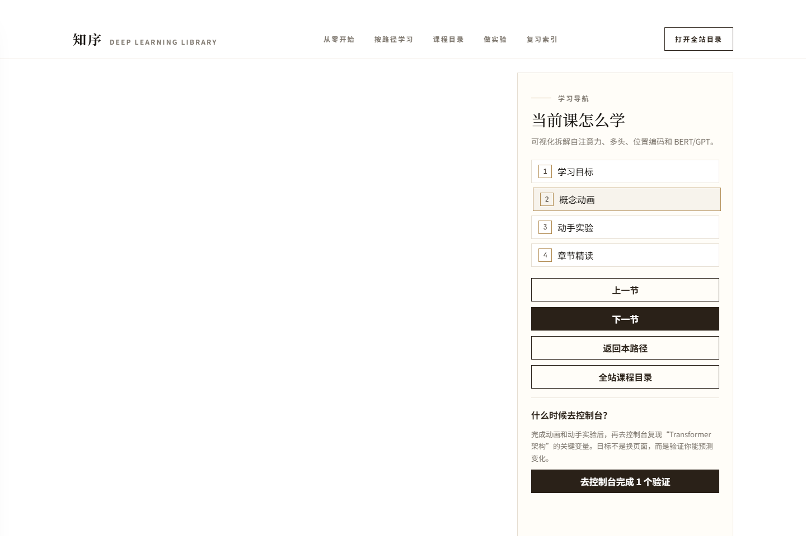
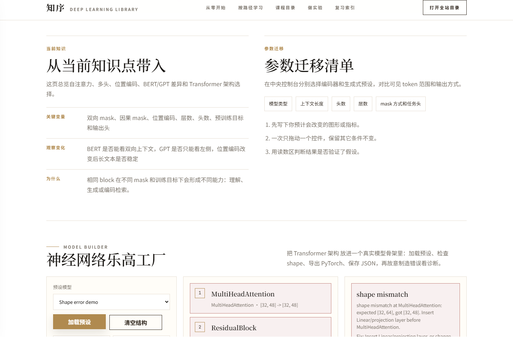
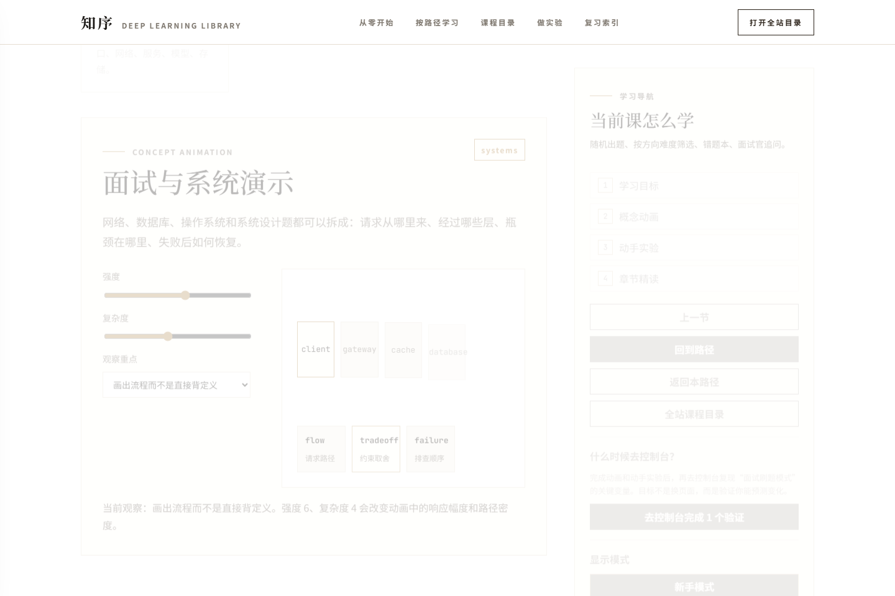

# 深度学习交互式学习网站

[](https://github.com/syzzzzzzz/deep-learning-interactive-lab/actions/workflows/quality.yml)
[](https://github.com/syzzzzzzz/deep-learning-interactive-lab/actions/workflows/pages.yml)

这是一个面向零基础学习者的深度学习交互式学习网站。它把张量、梯度、CNN、RNN、Transformer、训练调参、工程框架和 CS 基础做成可以阅读、调参、观察、复盘的学习产品。

在线体验地址：

```text
https://syzzzzzzz.github.io/deep-learning-interactive-lab/
```

如果 Pages 刚开启，第一次发布可能需要在 GitHub 仓库的 `Settings -> Pages` 中选择 `GitHub Actions` 作为发布来源。

## 这个网站适合谁

这个网站想做的事情很简单：把“看不见的模型过程”变成可以一步步观察、修改和复盘的学习体验。它不急着证明功能很多，而是先帮助学习者知道下一步该看哪里、调哪里、为什么会这样。

- 第一次学深度学习的人：先看 3 分钟版，再看动画，再动手实验。
- 已经学过一点的人：阅读完整讲义、源码对照和工程解释，把零散概念连成一条线。
- 想做项目实践的人：进入中央控制台拼模型、看 shape、导出代码，再回到课程页理解每个部件。

## 截图

| 首页学习路径 | Transformer 课程页 |
|---|---|
|  |  |

| 中央控制台 | Shape 诊断 |
|---|---|
|  |  |

| CS 面试训练营 |
|---|
|  |

截图由 Playwright 自动生成：

```powershell
npm run screenshots
```

## 核心亮点

- **课程学习闭环**：课程页包含本节主线、3 分钟版、概念动画、动手实验、完整讲义、源码对照、我已理解、加入复习、下一节。
- **中央控制台**：支持模型预设、shape 诊断、JSON 保存/加载、PyTorch 代码导出。
- **神经网络乐高工厂**：用模型构建器把 MLP、CNN、Transformer mini 组合成可解释结构。
- **拖拽式节点画布**：把知识点拆成数据、模块、损失、优化和观测节点，用结构帮助学生理解模型流。
- **训练事件总线**：一次调参事件同时更新 loss、梯度、特征/注意力和实验笔记。
- **学习成果档案**：把学习路径、实验记录、源码片段和项目结构放在一起，方便复盘。
- **深度实验室**：包含模型可解释性、对抗样本、训练挑战、端到端案例。
- **CS 基础训练营**：覆盖网络、数据库、算法、操作系统、深度学习、系统设计和自测追问。
- **旧脚本协议化**：38 个历史教学脚本统一纳入 `compute / render / smoke` 协议。
- **质量门与 E2E**：Python 全量质量门 + Playwright 桌面/移动端真实浏览器测试。

## 当前能力

### 课程体系

- `part1_foundations`：数学基础、张量、梯度、经典机器学习、神经网络基础
- `part2_cnn`：卷积直觉、特征图、经典 CNN、现代 CNN、Grad-CAM、迁移学习
- `part3_rnn`：RNN、隐藏状态、序列任务、Seq2Seq、文本分类、高级训练
- `part4_transformer`：注意力机制、多头注意力、Encoder/Decoder、最小 Transformer、Flash Attention
- `part5_toolbox`：特征可视化、梯度监控、训练动态、超参搜索、部署工具、测验系统
- `part6_universal_framework`：统一接口、模块化结构、项目骨架、插件系统、中央控制台、学习路径
- `part7_interview`：计算机网络、数据库 SQL、数据结构与算法、操作系统、系统设计、自测刷题

### 中央控制台

模型构建器当前支持：

- `Embedding`
- `MultiHeadAttention`
- `LayerNorm`
- `ResidualBlock`
- `TransformerEncoder`
- `Flatten`
- `Dropout`
- `Linear`

预设模型：

- `MLP baseline`
- `CNN classifier`
- `Transformer mini`
- `Shape error demo`

它可以展示每层输入/输出 shape，发现 `shape mismatch` 时给出修复建议，例如插入 `Linear/projection layer`。

## 技术栈

- 前端：HTML、CSS、JavaScript
- 可视化：原生 SVG / DOM 动画、Matplotlib、Plotly
- 教学脚本：Python、NumPy、PyTorch、Streamlit legacy
- 自动化：GitHub Actions、Playwright
- 质量门：Python AST 检查、内容检查、smoke test、浏览器 E2E
- 部署：GitHub Pages

## 本地启动

推荐使用静态站入口：

```powershell
python main.py
```

启动后打开终端打印的地址，例如：

```text
http://127.0.0.1:8000
```

指定端口：

```powershell
python main.py --port 4173
```

也可以直接使用 Python 静态服务：

```powershell
python -m http.server 8000 --bind 127.0.0.1
```

Windows 可以双击：

```text
start_lab.bat
```

## 常用命令

安装 Python 依赖：

```powershell
python -m pip install -r requirements.txt
```

安装前端测试依赖：

```powershell
npm ci
npx playwright install chromium
```

查看模块列表：

```powershell
python main.py --menu
```

运行单个旧教学模块：

```powershell
python main.py part2_cnn/01_convolution_visual
```

不要用 `streamlit run main.py` 启动主站。主站现在是静态 HTML 学习体验；Streamlit 只作为 legacy 调试入口保留。

## 质量检查

提交前建议运行：

```powershell
python -X utf8 scripts\quality_check.py
npm run test:e2e
```

快速跳过 smoke：

```powershell
python -X utf8 scripts\quality_check.py --skip-smoke
```

当前质量门覆盖：

- Python 编译和语法警告
- 静态站 HTML/CSS/JS 结构
- 课程目录 Source of Truth
- 知识图谱路由
- 旧脚本协议
- 运行产物污染
- 38 个旧脚本 smoke
- 6 个重点页面渲染 smoke
- Playwright 桌面和移动端课程闭环
- Playwright 中央控制台模型构建器

## GitHub Actions

项目包含两个工作流：

- `.github/workflows/quality.yml`：运行 Python 质量门和 Playwright E2E。
- `.github/workflows/pages.yml`：质量门通过后打包静态站并发布到 GitHub Pages。

当前工作流使用：

- `actions/checkout@v6`
- `actions/setup-python@v6`
- `actions/setup-node@v6`
- Node 24
- Python 3.12
- Playwright Chromium

## 文档

- [架构说明](docs/architecture.md)
- [教学设计说明](docs/teaching_design.md)
- [旧脚本协议审计](docs/legacy_protocol_audit.md)
- [深模块架构 PRD](docs/prd_deep_module_architecture.md)

## 后续路线图

- 将中央控制台升级为更完整的拖拽连线模型编辑器。
- 增加更多真实训练联动：CNN 特征图、注意力热力图、梯度流和参数更新动画。
- 扩展 Playwright E2E 覆盖：首页搜索、八股文训练营、移动端长页面学习路径。
- 增加线上访问监控和错误上报。
- 继续统一旧脚本 runtime adapter，减少手写页面差异。

## 维护约定

- 根目录不能留下 `*.png`、`*.csv`、`*.pt`、`*.log`、`__pycache__` 等运行产物。
- 新增章节优先更新 `components/course_manifest.py`，再让质量门派生路由和图谱。
- 新增交互功能要补 Playwright E2E 或对应 Python 质量门。
- 面向初学者的页面先解释图和控件，再展示源码。
