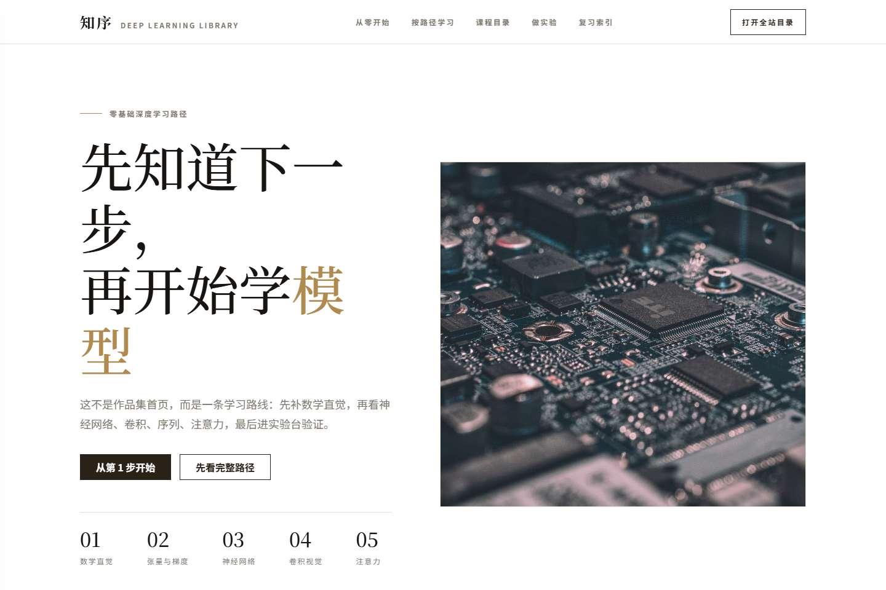
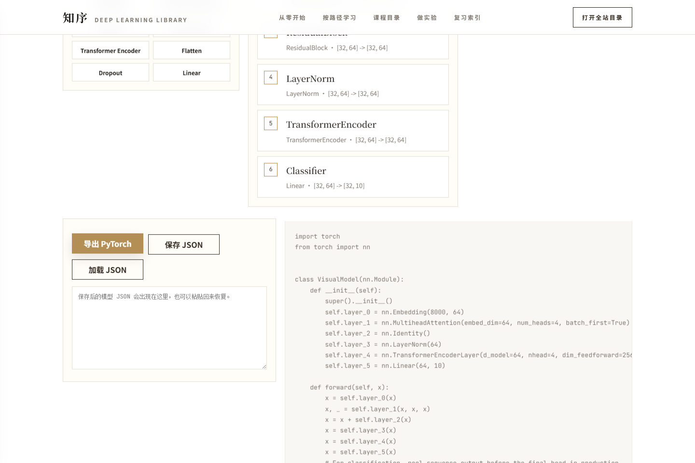

# 深度学习交互式学习网站

[](https://github.com/syzzzzzzz/deep-learning-interactive-lab/actions/workflows/quality.yml)
[](https://github.com/syzzzzzzz/deep-learning-interactive-lab/actions/workflows/pages.yml)

这是我做的一个深度学习交互式学习网站。最开始它只是一些 Python 教学脚本，后来我一点点把它改成了可以在浏览器里看的学习站：有课程页、有动画、有调参实验，也有一个还很早期的模型控制台。

我想解决的问题很朴素：很多深度学习概念只看公式会很硬，只看图又容易像看热闹。所以这个项目尝试把“讲解、图、参数、源码”放在同一个页面里，让学习者可以一边看解释，一边动手改东西，再回头看代码到底做了什么。

在线地址：

```text
https://syzzzzzzz.github.io/deep-learning-interactive-lab/
```

## 先说清楚

这个项目还在持续整理中，不是一本权威教材，也不是一个成熟框架。

- 里面的讲解和例子是我自己的理解，可能有不准确、过度简化或者还没校对干净的地方。
- 很多动画是为了教学直觉做的简化，不等价于真实训练过程。
- 代码结构已经重构过几轮，但还谈不上漂亮；现在只是比一开始更容易维护一些。
- 一些模块只是“做出来了第一版”，离我心里真正顺滑、完整、有美感的版本还有距离。

我把这些限制写出来，是因为我更希望这个仓库像一个真实的学习和打磨过程，而不是一个被包装得很满的成品。

## 截图

| 首页学习路径 | 中央控制台 |
|---|---|
|  |  |

截图可以用 Playwright 重新生成：

```powershell
npm run screenshots
```

## 目前做到了什么

**课程页**

每个知识点尽量按“先看 3 分钟版、再看动画、再动手实验、最后看源码”的顺序组织。这个顺序是给初学者留的缓冲，不想让人一上来就被大段源码和公式压住。

**中央控制台**

中央控制台现在能加载几个模型预设，查看每层输入/输出 shape，做简单的 shape 诊断，保存/加载 JSON 结构，并导出一段 PyTorch 代码。它还不是完整拖拽式建模器，但已经能表达“模型是由一层一层拼出来的”这个核心感觉。

**拖拽式节点画布**

我做了一个比较轻量的节点画布，把数据、层、损失、优化器和观测指标放成一条模型流。它更多是教学辅助，不是专业建模工具。

**训练事件总线**

页面里有一个训练事件总线的雏形：调参后可以同步更新 loss、梯度、特征/注意力和实验笔记。现在它偏教学模拟，后面还需要继续和真实训练过程接得更紧。

**学习成果档案**

网站里保留了学习路径、源码片段、实验记录和项目结构说明。它不是为了炫技，更多是方便复盘：我学到哪了、哪里没懂、哪段代码对应哪个现象。

**深度实验室**

里面放了一些模型可解释性、对抗样本、训练挑战和端到端案例的交互实验。它们目前有演示价值，但不少还需要补更细的文字解释和更真实的数据流。

**CS 基础训练营**

也加了一些网络、数据库、算法、操作系统、系统设计和自测追问内容。它不是主线，只是我希望深度学习学习者不要完全脱离工程基础。

## 课程范围

- `part1_foundations`：数学基础、张量、梯度、经典机器学习、神经网络基础
- `part2_cnn`：卷积直觉、特征图、经典 CNN、现代 CNN、Grad-CAM、迁移学习
- `part3_rnn`：RNN、隐藏状态、序列任务、Seq2Seq、文本分类、高级训练
- `part4_transformer`：注意力机制、多头注意力、Encoder/Decoder、最小 Transformer、Flash Attention
- `part5_toolbox`：特征可视化、梯度监控、训练动态、超参搜索、部署工具、测验系统
- `part6_universal_framework`：统一接口、模块化结构、项目骨架、插件系统、中央控制台、学习路径
- `part7_interview`：计算机网络、数据库 SQL、数据结构与算法、操作系统、系统设计、自测刷题

## 技术栈

- 前端：HTML、CSS、JavaScript
- 可视化：原生 SVG / DOM 动画、Matplotlib、Plotly
- 教学脚本：Python、NumPy、PyTorch、Streamlit legacy
- 自动化：GitHub Actions、Playwright
- 质量检查：Python 编译检查、内容检查、smoke test、浏览器 E2E
- 部署：GitHub Pages

## 本地启动

推荐使用静态站入口：

```powershell
python main.py
```

启动后打开终端打印的地址，例如：

```text
http://127.0.0.1:8000
```

指定端口：

```powershell
python main.py --port 4173
```

也可以直接使用 Python 静态服务：

```powershell
python -m http.server 8000 --bind 127.0.0.1
```

Windows 可以双击：

```text
start_lab.bat
```

不要用 `streamlit run main.py` 启动主站。主站现在是静态 HTML 学习体验；Streamlit 只作为 legacy 调试入口保留。

## 常用命令

安装 Python 依赖：

```powershell
python -m pip install -r requirements.txt
```

安装前端测试依赖：

```powershell
npm ci
npx playwright install chromium
```

查看模块列表：

```powershell
python main.py --menu
```

运行单个旧教学模块：

```powershell
python main.py part2_cnn/01_convolution_visual
```

生成截图：

```powershell
npm run screenshots
```

## 质量检查

提交前我一般会跑：

```powershell
python -X utf8 scripts\quality_check.py
npm run test:e2e
```

快速跳过 smoke：

```powershell
python -X utf8 scripts\quality_check.py --skip-smoke
```

目前质量门主要检查：

- Python 文件能不能编译
- 静态站 HTML/CSS/JS 的基础结构
- 课程目录和知识图谱是否能对上
- 旧脚本是否符合 `compute / render / smoke` 协议
- 根目录是否被运行产物污染
- 一批重点页面是否能 smoke 渲染
- Playwright 桌面和移动端课程闭环
- Playwright 中央控制台模型构建器

这些检查不是银弹，只是帮我少犯一些低级错误。

## GitHub Actions

项目包含两个工作流：

- `.github/workflows/quality.yml`：运行 Python 质量门和 Playwright E2E。
- `.github/workflows/pages.yml`：质量门通过后打包静态站并发布到 GitHub Pages。

当前工作流使用 Node 24、Python 3.12 和 Playwright Chromium。

## 文档

- [架构说明](docs/architecture.md)
- [教学设计说明](docs/teaching_design.md)
- [内容可信度规范](docs/content_credibility.md)
- [公开来源清单](docs/references/source_catalog.md)
- [旧脚本协议审计](docs/legacy_protocol_audit.md)
- [深模块架构 PRD](docs/prd_deep_module_architecture.md)

## 我还想继续改的地方

- 继续把课程文字写得更像给高中生解释，而不是像给已经懂的人复述。
- 让动画和控件绑定得更紧：每个按钮、滑块、热力图都要说明“现在该盯哪里”。
- 继续整理旧脚本，减少历史包袱和重复写法。
- 把中央控制台做得更像真正可用的模型拼装台，而不只是一个演示面板。
- 给更多页面补上“常见误区、错误样本、工程场景”和更清楚的源码对照。
- 持续修 UI：少一点空白误解，少一点模板味，多一点学习路径感。

## 维护约定

- 根目录不能留下 `*.png`、`*.csv`、`*.pt`、`*.log`、`__pycache__` 等运行产物。
- 新增章节优先更新 `components/course_manifest.py`，再让质量门派生路由和图谱。
- 新增交互功能要补 Playwright E2E 或对应 Python 质量门。
- 面向初学者的页面先解释图和控件，再展示源码。
